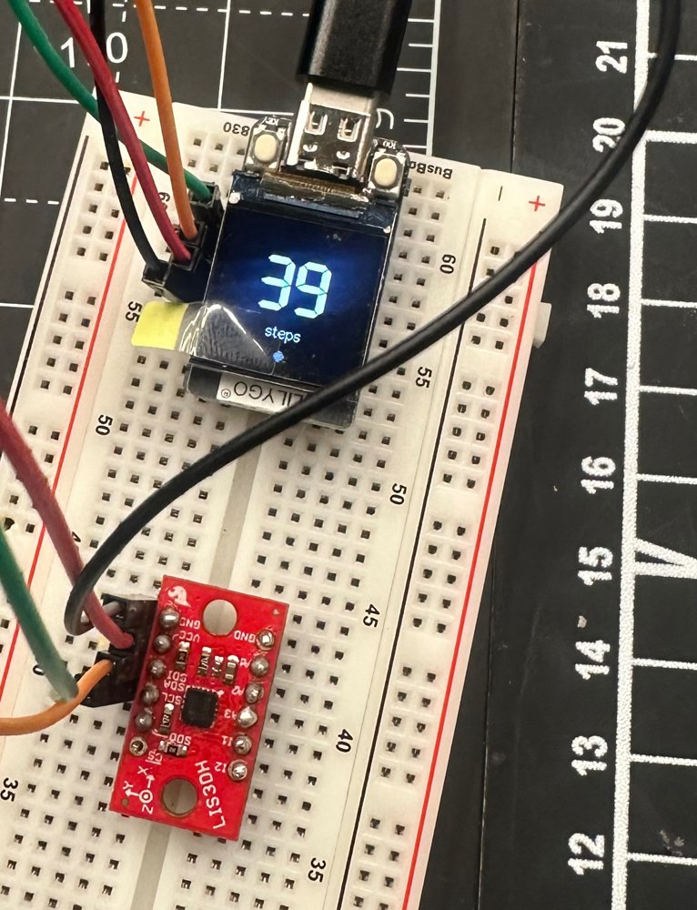
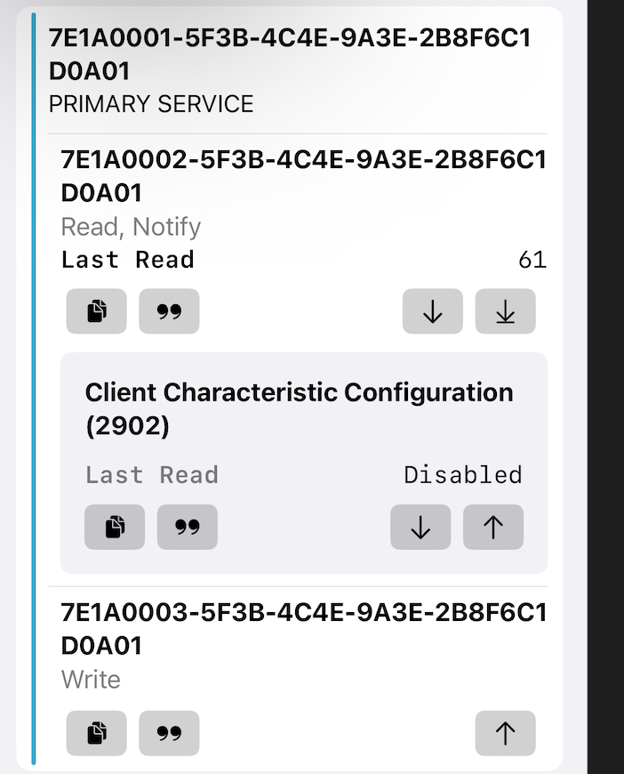
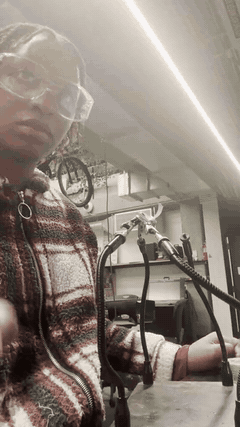
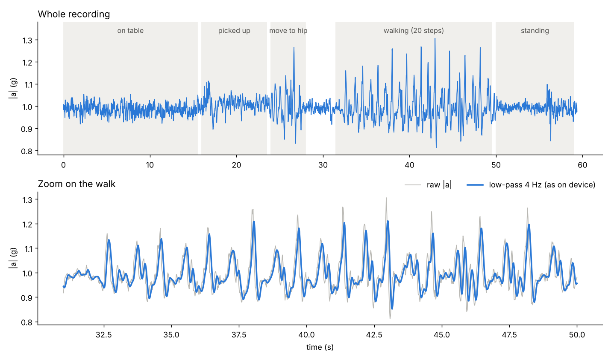

# Clip-on step counter: LIS3DH + LilyGO T-QT (ESP32-S3)

A step counter I built from a bare accelerometer and a tiny ESP32-S3 board. It reads the
sensor over I2C, detects steps with an algorithm I tuned on my own recorded walking data,
shows today's count on the board's 0.85" screen, keeps the count through power loss, and
publishes it over Bluetooth Low Energy.

<p align="center">
  
</p>

## Why I built it

My friends and I compete on Stompers, a step-ranking app. Steps I took without my phone
in my pocket never counted. So I built my own counter that I can wear without the phone.

## What works

| Feature | Status |
|---|---|
| LIS3DH configured at register level over I2C (50 Hz, ±4 g, 12-bit) | ✅ |
| Steady 50 Hz sampling using the sensor's data-ready flag | ✅ verified: every sample 20 ms apart, no gaps |
| Step detection (filter, adaptive threshold, timing and rhythm rules) | ✅ 20/20 on my recorded walk |
| Step count on the T-QT screen, flicker-free | ✅ |
| Count saved in flash, survives unplugging | ✅ |
| Bluetooth LE: total steps (read + notify), set clock (write) | ✅ reading verified with nRF Connect on iPhone |
| "Steps today" with midnight rollover (clock set by the phone) | 🧪 implemented, not yet tested across a real midnight |
| Writing steps to Apple Health | ⏳ next step (see [Next steps](#next-steps)) |

<p align="center">
  
  <br><em>An iPhone reading the step count (61) from my Bluetooth service.</em>
</p>

## Hardware

- [LilyGO T-QT Pro](https://github.com/Xinyuan-LilyGO/T-QT), N8 version (ESP32-S3, 8 MB flash, no PSRAM, 128×128 IPS screen)
- [SparkFun Triple Axis Accelerometer Breakout, LIS3DH](https://github.com/sparkfun/LIS3DH_Breakout) (SEN-13963)

| LIS3DH | T-QT | Why |
|---|---|---|
| VCC | 3V | The LIS3DH is a 3.3 V part; above ~3.6 V damages it |
| GND | GND | |
| SDA | IO16 | Same I2C pins LilyGO uses in its own sensor example (`examples/SensorBNO080`) |
| SCL | IO17 | |
| I1 | IO18 | Wired for later (interrupt-driven wake-up) |

The address jumper on the LIS3DH is left open, which gives I2C address **0x19**.

<p align="center">
  
  <br><em>Soldering the headers (timelapse; full clip in <a href="media/soldering_timelapse.mp4">media/soldering_timelapse.mp4</a>).</em>
</p>

## How it works

### 1. Talking to the sensor
I didn't use a sensor library. I wrote the register reads and writes myself from the
LIS3DH datasheet, so I can explain every byte:

| Register | Value | Meaning |
|---|---|---|
| `WHO_AM_I` (0x0F) | reads `0x33` | Confirms it's really a LIS3DH before configuring anything |
| `CTRL_REG1` (0x20) | `0x47` | 50 Hz output data rate, normal mode, X/Y/Z enabled |
| `CTRL_REG4` (0x23) | `0x98` | Block data update, ±4 g range, high-resolution (12-bit) |
| `STATUS` (0x27) | bit 3 | New X/Y/Z sample ready, used to pace the loop at exactly 50 Hz |
| `OUT_X_L` (0x28) | 6 bytes | X, Y, Z read in one burst (`0x28 \| 0x80` = auto-increment) |

Each axis is a 12-bit value left-justified in 16 bits, so it is shifted right by 4 and
multiplied by 2 mg per count (±4 g, high-resolution). Lying flat, the board reads about
0.985 g on Z: gravity, plus the sensor's small zero-g offset.

I use the **magnitude** √(x² + y² + z²), so the count doesn't depend on how the device is
tilted or clipped on.

### 2. Recording real data first
Before writing any step logic, I recorded myself: board on the table, picked up, moved to
my hip, **exactly 20 steps**, then standing still. That's
[`data/walk_20_steps.csv`](data/walk_20_steps.csv) (3,015 samples at 50 Hz).



What the data showed:
- Each step is a sharp spike to about 1.1–1.2 g, then a dip to about 0.9 g. Standing still stays within about ±0.05 g.
- Each step has a smaller second bump right after the main spike.
- One step had two peaks only 0.28 s apart.
- Picking the board up and moving it to my hip also made spikes as tall as real steps, but at uneven intervals.

### 3. The detection rules
Each rule comes from something visible in the data:

1. **Low-pass filter (4 Hz, 2nd-order Butterworth biquad).** Walking energy sits around 1–3 Hz; this smooths jitter and blocks vibration better than a moving average.
2. **Hysteresis.** A step is one full swing: up past an "arm" level, then back down. Two levels instead of one stop noise near a single line from counting twice.
3. **Minimum gap 0.3 s.** Rejects the double peak (no one steps faster than about 3–4 per second).
4. **Maximum gap 2.0 s.** A longer pause ends the walk.
5. **Regularity.** A walk only starts counting after 4 steps in a row with steady timing (each gap within 1.4× of the previous one). Then those 4 are credited at once.

I measured what each rule contributes by replaying the recording
([`analysis/replay.py`](analysis/replay.py)):

| Rules applied | Count (true: 20) |
|---|---|
| Threshold only | 26 |
| + 0.3 s minimum gap | 25 |
| + 4 steps in a row | 25 (moving it to my hip still sneaks in) |
| + steady rhythm | **20** |

The rhythm check was the surprise: the hip move produced 6 peaks in a row, so "4 in a
row" alone wasn't enough, but their spacing was uneven (0.36 s, then 0.63 s) while real
steps were steady (0.8–0.9 s).

### 4. v1 → v2: making it work wherever it's worn
v1 used a fixed arm level of 1.06 g. Testing it live, it **missed steps**: in a pocket or
with softer steps, the spikes never reached 1.06 g. A second problem: once walking, one
uneven step reset the counter and threw away steps until 4 new steady ones.

v2 fixes both:
- It tracks a slow **baseline** (the resting level) and a running **typical step height**, and arms at **40% of the typical step** above the baseline (never below 0.03 g, which keeps standing-still noise out).
- The rhythm rule only applies while confirming a walk; once walking, an uneven step still counts.

Same recording, with the steps scaled down to simulate softer placements:

| Step strength | v1 (fixed 1.06 g) | v2 (adaptive) |
|---|---|---|
| 100% | 20 | 20 |
| 60% | 9 | 20 |
| 40% | 4 | 19 |

### 5. Screen, saving, Bluetooth
- **Screen:** each frame is drawn into a 128×128 sprite in RAM (32 KB) and pushed to the panel in one go, so the number never flickers. It only redraws when something changes. A redraw takes a few ms, well inside the 20 ms between samples, so no sensor data is missed.
- **Saving:** the count is stored in the ESP32's flash (NVS, via `Preferences`). Flash wears out with writes, so it saves at most every 30 s and only if the count changed. The trade-off is up to 30 s of steps lost if power is cut mid-walk.
- **Bluetooth LE:** a custom GATT service.

| Characteristic | UUID | Properties | Data |
|---|---|---|---|
| Steps | `7e1a0002-5f3b-4c4e-9a3e-2b8f6c1d0a01` | Read, Notify | Total steps, uint32 little-endian |
| Time | `7e1a0003-5f3b-4c4e-9a3e-2b8f6c1d0a01` | Write | 4 bytes UTC seconds + 4 bytes time-zone offset |

The T-QT has no real-time clock, so the phone sets the time. The device keeps two numbers:
the **total** (never reset, what a phone syncs) and **today** (total minus the total at
the last midnight, what the screen shows). Nothing is deleted at midnight, so steps from
late last night can still be synced the next morning.

## Repository layout

```
firmware/                  Arduino sketches, in the order I built them
  01_i2c_scanner           find the sensor on the bus (0x19)
  02_who_am_i              confirm it's a LIS3DH (0x33)
  03_read_acceleration     configure registers, print x/y/z in g
  04_sample_50hz_logger    data-ready-paced 50 Hz logging (made the recording)
  05_step_counter_v1_fixed_threshold
  06_step_counter_v2_adaptive
  07_step_counter_v3_display
  08_step_counter_v4_flash
  09_step_counter_v5_bluetooth      <- latest
data/walk_20_steps.csv     my recorded walk
analysis/replay.py         replays the recording through the detection logic
analysis/plot_walk.py      makes media/walk_plot.png
media/                     photos, plot, soldering timelapse
```

## Building it

1. Arduino IDE with **esp32 by Espressif Systems, version 2.0.14**. The T-QT README warns its display library breaks on newer versions.
2. Copy everything in LilyGO's [`T-QT/lib`](https://github.com/Xinyuan-LilyGO/T-QT/tree/main/lib) into your Arduino `libraries` folder. Use **their patched TFT_eSPI**, not the stock one, and don't let the IDE update it.
3. Tools menu (N8 board): ESP32S3 Dev Module, USB CDC On Boot: Enabled, Flash Size: 8MB, Partition Scheme: 8M with spiffs (3MB APP/1.5MB SPIFFS), PSRAM: Disabled, USB Mode: Hardware CDC and JTAG.
4. Open `firmware/09_step_counter_v5_bluetooth` and upload. If upload fails, hold IO0 while plugging in USB.

Hold the left button (IO0) for 2 s to reset the count. To replay the analysis:
`python3 analysis/replay.py` (no dependencies).

## Next steps

- **Apple Health.** Planned path: a small iPhone app (CoreBluetooth + HealthKit) that reads the total, remembers the last value it synced, and saves only the difference as a step sample. My Mac's macOS is too old for the current Xcode, so my fallback design is Wi-Fi: the ESP32 serves `/pending` (unsynced steps) and `/ack` (confirm), and an iPhone Shortcut uses the built-in "Log Health Sample" action. Confirming only after Health accepts the data means steps are never lost or counted twice.
- **Battery life.** The sensor draws almost nothing; the screen and CPU draw nearly everything. Plans: screen off after a few seconds, the LIS3DH's 32-sample FIFO so the CPU sleeps between batches, and a lower CPU clock. I want to measure current before and after each change instead of estimating.
- **More test data:** pocket, bag, stairs, running, and a longer validation walk.
- **Enclosure** with a clip and a LiPo battery (the T-QT Pro can charge one).

## References

- ST, [LIS3DH datasheet](https://www.st.com/resource/en/datasheet/lis3dh.pdf)
- SparkFun, [LIS3DH Hookup Guide](https://learn.sparkfun.com/tutorials/lis3dh-hookup-guide) and [breakout repo](https://github.com/sparkfun/LIS3DH_Breakout)
- LilyGO, [T-QT repository](https://github.com/Xinyuan-LilyGO/T-QT) (pin map, TFT_eSPI setup, examples)
- N. Zhao, "Full-Featured Pedometer Design Realized with 3-Axis Digital Accelerometer," *Analog Dialogue* 44-06, Analog Devices (dynamic-threshold approach)
- R. Bristow-Johnson, *Audio EQ Cookbook* (biquad low-pass coefficients)
